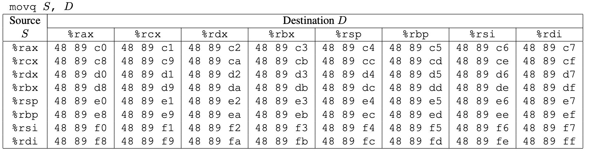
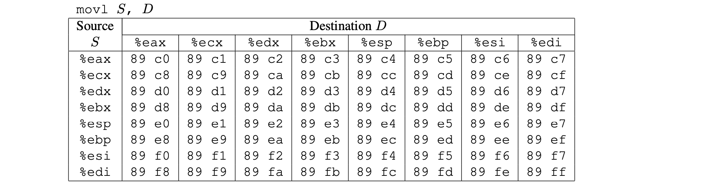

# [Attack Lab](http://csapp.cs.cmu.edu/3e/labs.html) [Updated 1/12/16]

Note: This is the 64-bit successor to the 32-bit Buffer Lab. You are given a pair of unique custom-generated x86-64 binary executables, called targets, that have buffer overflow bugs. One target is vulnerable to code injection attacks. The other is vulnerable to return-oriented programming attacks.

You are asked to modify the behavior of the targets by developing exploits based on either code injection or return-oriented programming. This lab is about the stack discipline and the danger of writing code that is vulnerable to buffer overflow attacks.

Here are a pair of Ubuntu 12.4 targets that you can try out for yourself. You'll need to run your targets using the "-q" option so that they don't try to contact a non-existent grading server.

## Source

Here are a pair of Ubuntu 12.4 targets in `source/`, more details in [README](source/README.txt).

```Shell
source
├── README.txt # A file describing the contents of the directory
├── cookie.txt # An 8-digit hex code that you will use as a unique identifier in your attacks
├── ctarget    # An executable program vulnerable to code-injection attacks
├── farm.c     # The source code of your target’s “gadget farm,” which you will use in generating return-oriented programming attacks
├── hex2raw    # A utility to generate attack strings
└── rtarget    # An executable program vulnerable to return-oriented-programming attacks
```

## Part I: Code Injection Attacks

For the first three phases, your exploit strings will attack CTARGET. This program is set up in a way that the stack positions will be consistent from one run to the next and so that data on the stack can be treated as executable code. These features make the program vulnerable to attacks where the exploit strings contain the byte encodings of executable code.

### Level 1

For Phase 1, you will not inject new code. Instead, your exploit string will redirect the program to execute an existing procedure.

Function `getbuf` is called within `CTARGET` by a function `test` having the following `C` code:

```C
void test()
{
    int val;
    val = getbuf();
    printf("No exploit. Getbuf returned 0x%x\n", val);
}
```

When `getbuf` executes its return statement (line 5 of `getbuf`), the program ordinarily resumes execution within function `test` (at line 5 of this function). We want to change this behavior. Within the file `ctarget`, there is code for a function `touch1` having the following `C` representation:

```C
void touch1()
{
    vlevel = 1; /* Part of validation protocol */
    printf("Touch1!: You called touch1()\n");
    validate(1);
    exit(0);
}
```

Your task is to get `CTARGET` to execute the code for `touch1` when `getbuf` executes its return statement, rather than returning to `test`. Note that your exploit string may also corrupt parts of the stack not directly related to this stage, but this will not cause a problem, since `touch1` causes the program to exit directly.

### Level 2

Phase 2 involves injecting a small amount of code as part of your exploit string.

Within the file `ctarget` there is code for a function `touch2` having the following `C` representation:

```C
void touch2(unsigned val)
{
    vlevel = 2; /* Part of validation protocol */
    if (val == cookie) 
    {
        printf("Touch2!: You called touch2(0x%.8x)\n", val);
        validate(2);
    }
    else 
    {
        printf("Misfire: You called touch2(0x%.8x)\n", val);
        fail(2);
    } 
    exit(0);
}
```

Your task is to get `CTARGET` to execute the code for `touch2` rather than returning to `test`. In this case, however, you must make it appear to `touch2` as if you have passed your cookie as its argument.

### Level 3

Phase 3 also involves a code injection attack, but passing a string as argument.

Within the file `ctarget` there is code for functions hexmatch and `touch3` having the following `C` representations:

```C
/* Compare string to hex represention of unsigned value */
int hexmatch(unsigned val, char *sval)
{
    char cbuf[110];
    /* Make position of check string unpredictable */
    char *s = cbuf + random() % 100;
    sprintf(s, "%.8x", val);
    return strncmp(sval, s, 9) == 0;
}

void touch3(char *sval)
{
    vlevel = 3; /* Part of validation protocol */
    if (hexmatch(cookie, sval)) {
        printf("Touch3!: You called touch3(\"%s\")\n", sval);
        validate(3);
    } else {
        printf("Misfire: You called touch3(\"%s\")\n", sval);
        fail(3);
    }
    exit(0);
}
```

Your task is to get `CTARGET` to execute the code for `touch3` rather than returning to `test`. You must make it appear to `touch3` as if you have passed a string representation of your `cookie` as its argument.

### Writeups 

[Writeups](part1/README.md) for Part I.

## Part II: Return-Oriented Programming

Performing code-injection attacks on program `RTARGET` is much more difficult than it is for `CTARGET`, because it uses two techniques to thwart such attacks:

- It uses randomization so that the stack positions differ from one run to another. This makes it impos- sible to determine where your injected code will be located.
- It marks the section of memory holding the stack as nonexecutable, so even if you could set the program counter to the start of your injected code, the program would fail with a segmentation fault.

Fortunately, clever people have devised strategies for getting useful things done in a program by executing existing code, rather than injecting new code. The most general form of this is referred to as *return-oriented programming* (ROP) . The strategy with ROP is to identify byte sequences within an existing program that consist of one or more instructions followed by the instruction `ret`. Such a segment is referred to as a *gadget*.


This illustrates how the stack can be set up to execute a sequence of n gadgets. In this figure, the stack contains a sequence of gadget addresses. Each gadget consists of a series of instruction bytes, with the final one being `0xc3`, encoding the `ret` instruction. When the program executes a ret instruction starting with this configuration, it will initiate a chain of gadget executions, with the `ret` instruction at the end of each gadget causing the program to jump to the beginning of the next.

For example, one version of `rtarget` contains code generated for the following `C` function:

```C
void setval_210(unsigned *p)
{
    *p = 3347663060U;
}
```

The chances of this function being useful for attacking a system seem pretty slim. But, the disassembled machine code for this function shows an interesting byte sequence:

```Assembly
0000000000400f15 <setval_210>:
  400f15:       c7 07 d4 48 89 c7       movl   $0xc78948d4,(%rdi)
  400f1b:       c3                      retq
```

The byte sequence `48 89 c7` encodes the instruction `movq %rax, %rdi`. This sequence is followed by byte value `c3`, which encodes the `ret` instruction. The function starts at address `0x400f15`, and the sequence starts on the fourth byte of the function. Thus, this code contains a gadget, having a starting address of `0x400f18`, that will copy the 64-bit value in register `%rax` to register `%rdi`.

```Assembly
400f18:       48 89 c7                movq   %rax, %rdi
400f1b:       c3                      retq
```

Your code for `RTARGET` contains a number of functions similar to the `setval_210` function shown above in a region we refer to as the *gadget farm*. Your job will be to identify useful gadgets in the gadget farm and use these to perform attacks similar to those you did in Level 2 and 3 above.

Important: The gadget farm is demarcated by functions `start_farm` and `end_farm` in your copy of `rtarget`. Do not attempt to construct gadgets from other portions of the program code.

### Level 2

You will repeat the attack of Level 2 above, but do so on program `RTARGET` using gadgets from your gadget farm. You can construct your solution using gadgets consisting of the following instruction types, and using only the first eight x86-64 registers (`%rax–%rdi`).

- `movq`, `popq`, `ret`: The codes for these are shown in below.
- `nop`: This instruction (pronounced “no op,” which is short for “no operation”) is encoded by the single byte `0x90`. Its only effect is to cause the program counter to be incremented by 1.







### Level 3

Before you take on this, pause to consider what you have accomplished so far. In Part I, you caused a program to execute machine code of your own design. If `CTARGET` had been a network server, you could have injected your own code into a distant machine. In Part II, you circumvented two of the main devices modern systems use to thwart buffer overflow attacks. Although you did not inject your own code, you were able inject a type of program that operates by stitching together sequences of existing code.

This requires you to do an ROP attack on `RTARGET` to invoke function `touch3` with a pointer to a string representation of your `cookie`. That may not seem significantly more difficult than using an ROP attack to invoke `touch2`, except that we have made it so.

To solve this, you can use gadgets in the region of the code in rtarget demarcated by functions `start_farm` and `end_farm`. In addition to the gadgets used in Leve 1, this expanded farm includes the encodings of different `movl` instructions. The byte sequences in this part of the farm also contain 2-byte instructions that serve as *functional nops*, i.e., they do not change any register or memory values. These include instructions, such as `andb %al,%al`, that operate on the low-order bytes of some of the registers but do not change their values.

Some Advice: The official solution requires eight gadgets (not all of which are unique).

Good luck and have fun!

### Writeups 

[Writeups](part2/README.md) for Part II.
